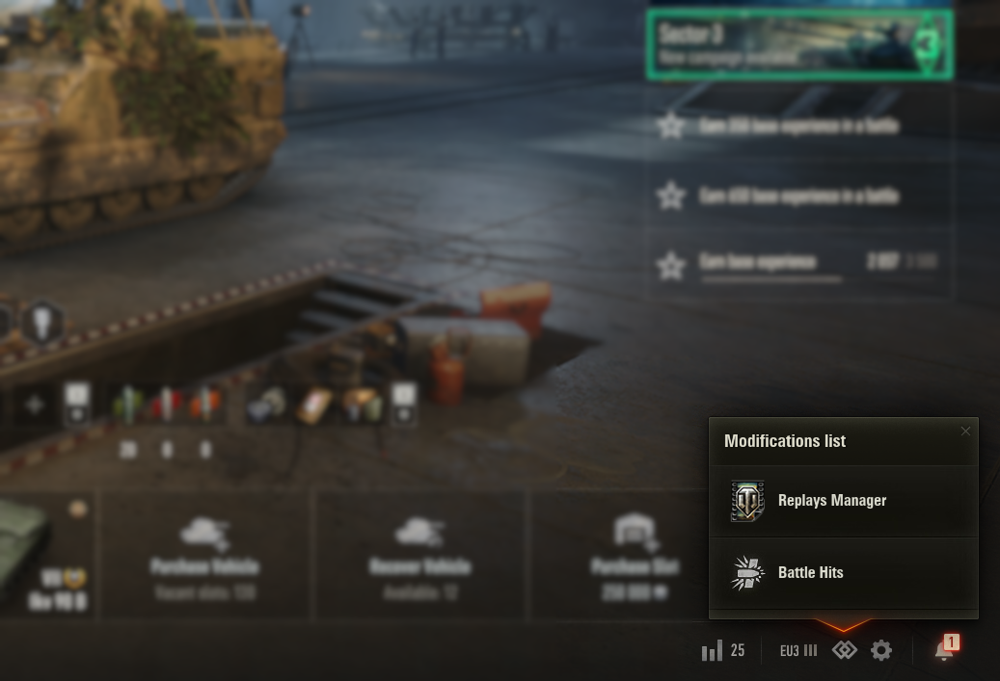

# ModsList - World of Tanks Mod

## 🚀 Overview

**ModsList** is a comprehensive modification for **World of Tanks** that brings together all your visual mods into one convenient place. It serves as a hub for managing mods like Mods Configurator, Battle Hits, Replays Manager, and many more, making the game experience easier.

## 🌟 Features

- 📋 **Centralized Mod Management**: Easily access and manage multiple mods in one place directly from the game.
- 🔄 **Flexible API Support**: **ModsList** is compatible with various APIs, making it adaptable to different mod configurations and needs.

## 📦 Dependency
This project relies on the [OpenWG Gameface](https://gitlab.com/openwg/wot.gameface/) mod. Make sure to include this mod to ensure the proper functionality of **ModsList**.

## 🛠️ Usage

- Add **ModsList** as a distribution to your mod.
- Add information about your mod using API for smooth integration.

## 🖼️ Screenshots

### Menu in the hangar:

### Menu in the login window:

## 💖 Donate

If you enjoy **ModsList** and would like to support its development, consider making a donation. Your contributions help improve the mod and keep it updated!

- **Support on Patreon**: [Patreon Link](https://www.patreon.com/poliroid)
- **Directly donate**: [Donation Methods](https://poliroid.me/donate/)

Thank you for your support!

## 📄 License

This project is licensed under the MIT License - see the [LICENSE](./LICENSE.md) file for details.

## 🤝 Contributing

Feel free to contribute to the project by submitting issues or pull requests! We welcome all forms of feedback and contributions from the World of Tanks community.

---

Enjoying ModsList? Consider supporting us by sharing this mod with other players!